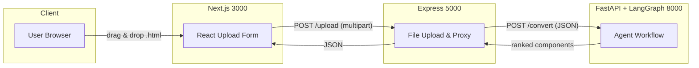
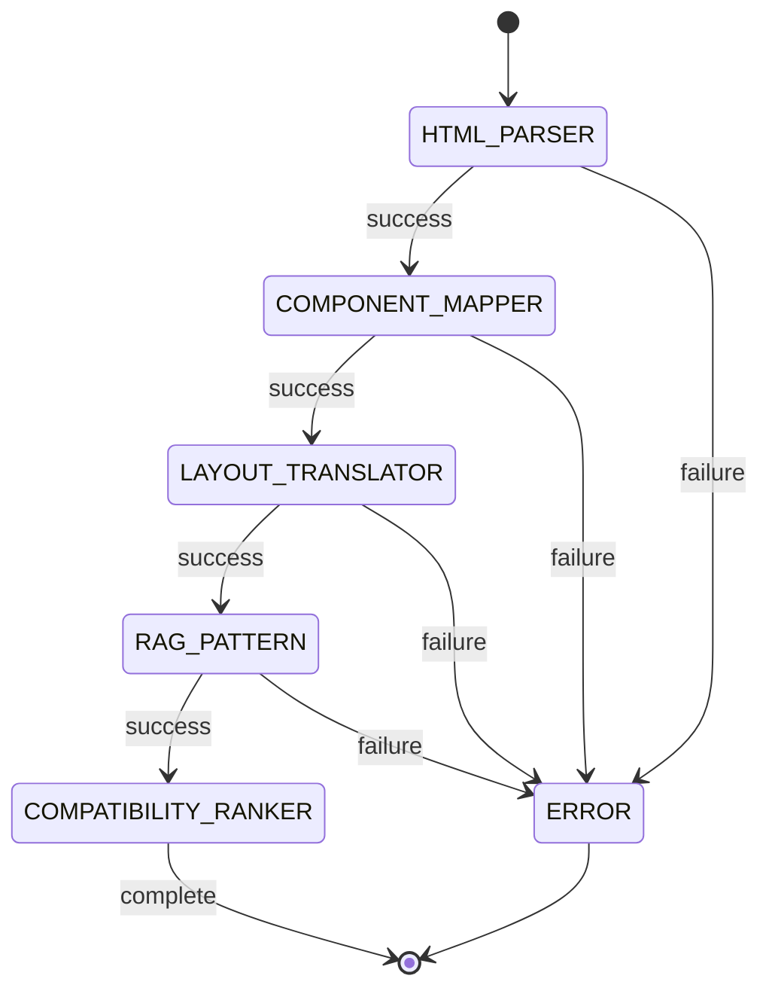

# Final Day Hackathon – HTML → LCNC Conversion Platform

> Low-code/no-code (LCNC) builder powered by an LLM-driven multi-agent workflow.

---

## 🗂 Project structure

```
Final Day Hackathon/
│
├─ ai/          # Python micro-service that hosts LangGraph agent workflow
├─ backend/     # Express gateway – receives file upload & calls `ai` service
├─ frontend/    # Next.js React SPA – drag-and-drop HTML uploader
└─ README.md    # ← you are here
```

| Folder    | Tech stack | Purpose |
|-----------|------------|---------|
| **frontend** | Next.js 14, React 18, TypeScript | Collects the userʼs `.html` file and shows results. |
| **backend**  | Node 18, Express, Multer          | Accepts multipart upload, reads HTML/CSS and forwards JSON payload to *ai* service. |
| **ai**       | Python 3.10, FastAPI, LangGraph, LangChain Core | Converts raw HTML/CSS into LCNC component spec through a chain of specialised agents. |

---

## ✨ Key components

1. **HTML parser agent** – tokenises & normalises HTML.
2. **Component mapper agent** – maps parsed chunks to LCNC component library.
3. **Layout translator agent** – converts absolute CSS layout to responsive flex/grid configuration.
4. **RAG pattern agent** – enriches with knowledge-base patterns (`ai/pattern_kb`).
5. **Compatibility ranker agent** – scores & ranks component suggestions for the target LCNC platform.

Agents are orchestrated with **LangGraph** using a conditional-edge state machine (see diagram below).

---

## 🛠 Getting started

Prerequisites: `git`, **Node ≥18**, **Python ≥3.10**, `pip`.

```bash
# clone repository
$ git clone <repo_url>
$ cd Final-Day-Hackathon

# 1️⃣  Start AI micro-service
$ python -m venv .venv && source .venv/bin/activate   # (Windows): .venv\Scripts\activate
$ pip install -r ai/requirements.txt
$ python ai/run_server.py   # listens on :8000

# 2️⃣  Start backend gateway
$ cd backend
$ npm install
$ node index.js            # listens on :5000

# 3️⃣  Start frontend
$ cd ../frontend
$ npm install
$ npm run dev              # http://localhost:3000
```

> Upload any **HTML file** from the UI; the response will contain a ranked LCNC component list in JSON.

---

## ⚙️ Environment variables

None are strictly required for the demo run. For production you may want to supply:

* `OPENAI_API_KEY` – used implicitly by LangChain/agents (read from env by default).
* `PORT_*`         – override service port numbers.

Ensure you keep secrets out of VCS (`.env*` is already in `.gitignore`).

---

## 🏗 System architecture



---

## 🤖 Agent workflow



Each state mutates a shared `WorkflowState` dict; conditional edges are resolved inside `ai/agent.py`.

---

## 📦 API reference

### POST /upload  *(backend)*
Uploads an HTML file.

| Form field | Type | Description |
|------------|------|-------------|
| `file`     | File | HTML document to convert |

Returns JSON forwarded from AI service.

### POST /convert  *(ai)*
Consumes raw HTML/CSS strings and returns conversion result.

Request body:
```json
{
  "html_content": "<html>...</html>",
  "css_content" : "body { ... }"
}
```

Response:
```json
{
  "status": "success",
  "components": [
    { "component": "Hero", "confidence": 0.92 },
    ...
  ],
  "error": null
}
```

---

## 🚀 Deployment notes

* *ai* and *backend* are stateless – scale them horizontally behind a load balancer.
* Prefer a dedicated object store (S3/GCS) for file uploads in production.
* Cache vector embeddings for pattern KB (`ai/vector_store`) to speed up RAG.

---

## 📝 License

MIT – feel free to fork & build upon this project. 